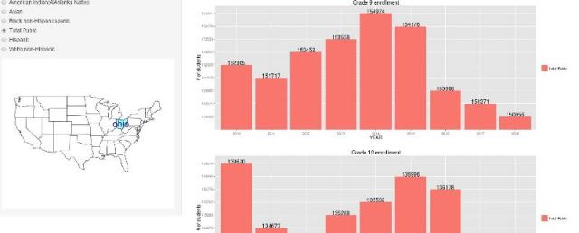

## Input Data File
The [product hosted on shinyapps](https://pkidambi.shinyapps.io/US_Public_HS_Enrollment) showcases the United States Public High School Enrollment trends over a timeline by US State, type of student and grade as downloaded from [WICHE](http://knocking.wiche.edu/download). Summary of the input data is showcased using the **summary** command in R
```{r echo = FALSE}
# read the data
library(xlsx)
options(warn=-1)
mydata <- read.xlsx2("data_products.xlsx","Data")
# Summary of Data
#summary(mydata)
# Header of Data
```
```{r}
# read the data
summary(mydata,4)

```
 

--- .class #id 

## Product Inputs
The end user can select the *United States State*, *Student Type* and *Timeframe for analysis* as showcased in the figure below 


--- .class #id 

## Product Outputs
The output is a US map with the selected US state highlighted and labeled, and bar plots of the high school enrollments in the selected time frame as showcased in the figure below. 





--- .class #id 

## Download & Future Updates
1. The data based on the end user inputs can be downloaded by clicking the download button on the **Data** tab. More information about the product can be found by clicking on **About** tab. 

2. Obtain US private school enrollment data and add it to our database

3. Update the product with primary school and middle school data

4. Create a prediction algorithm to predict the enrollment trends after 2027
